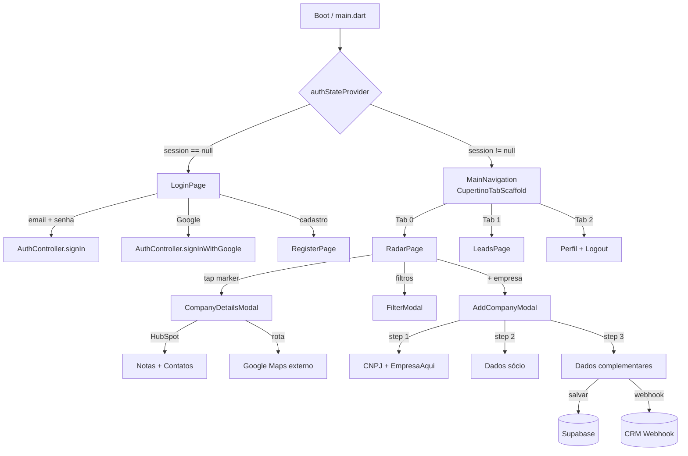

# RUMO App — Guia de Arquitetura

## Stack

| Camada | Tecnologia |
|---|---|
| UI | Flutter + Cupertino Widgets |
| State management | Riverpod 2 (Notifier + FutureProvider) |
| Backend | Supabase (Auth + PostgreSQL + RPC) |
| Mapa | Google Maps Flutter |
| CRM | HubSpot API v3 |
| API externa | EmpresaAqui (dados de CNPJ) |
| Deploy | Docker + nginx (Flutter Web) |

---

## Estrutura de diretórios

```
lib/
├── main.dart                          # Inicialização + roteamento por authState
│
├── core/
│   ├── app_config.dart                # Variáveis de ambiente (--dart-define-from-file)
│   └── services/
│       └── supabase_config.dart       # Inicialização do Supabase
│
└── features/
    ├── auth/                          # Autenticação e perfil do usuário
    │   ├── login_page.dart
    │   ├── register_page.dart
    │   └── providers/
    │       ├── auth_provider.dart     # authStateProvider + AuthController
    │       └── profile_provider.dart  # profileProvider + UserProfile model
    │
    ├── map/                           # Feature principal: mapa + radar de empresas
    │   ├── radar_page.dart            # Página do mapa (GoogleMap + bottom list)
    │   ├── models/
    │   │   └── company_model.dart     # Model Company (vem da RPC do Supabase)
    │   ├── providers/
    │   │   ├── company_provider.dart  # companiesProvider (FutureProvider)
    │   │   ├── location_provider.dart # locationProvider (GPS com fallback)
    │   │   └── filter_provider.dart   # MapFiltersNotifier + filterOptionsProvider
    │   ├── services/
    │   │   ├── company_service.dart   # Chamadas RPC ao Supabase
    │   │   └── tracking_service.dart  # Rastreamento de localização (timer 5 min)
    │   ├── data/
    │   │   └── company_repository.dart # Repository pattern (ICompanyRepository)
    │   └── presentation/
    │       ├── radar_viewmodel.dart   # Estado de UI do bottom sheet
    │       ├── filter_modal.dart      # Modal de filtros avançados
    │       └── company_details_modal.dart # Detalhes da empresa + HubSpot
    │
    ├── leads/                         # Feature de busca textual de leads
    │   ├── leads_page.dart
    │   └── leads_search_provider.dart # leadsSearchQueryProvider + leadsResultsProvider
    │
    └── company/                       # Cadastro de novas empresas
        ├── add_company_modal.dart     # Multi-step modal (3 passos)
        ├── hubspot_service.dart       # Integração HubSpot (notas + contatos)
        ├── registration_service.dart  # EmpresaAqui API + geocoding + Supabase upsert
        └── constants.dart             # Dropdowns: departamentos, setores, regimes, etc.
```

---

## Diagrama de providers

```mermaid
graph TD
    AUTH[authStateProvider<br/>StreamProvider&lt;AuthState&gt;]
    CTRL[authControllerProvider<br/>Provider&lt;AuthController&gt;]
    PROFILE[profileProvider<br/>FutureProvider&lt;UserProfile?&gt;]

    LOC[locationProvider<br/>FutureProvider&lt;Position&gt;]
    FILTERS[mapFiltersProvider<br/>NotifierProvider&lt;MapFilters&gt;]
    FILTER_OPTS[filterOptionsProvider<br/>FutureProvider&lt;Map&gt;]
    CITIES[filteredCitiesProvider<br/>Provider&lt;List&lt;String&gt;&gt;]
    REPO[companyRepositoryProvider<br/>Provider&lt;ICompanyRepository&gt;]
    COMPANIES[companiesProvider<br/>FutureProvider&lt;List&lt;Company&gt;&gt;]

    RADAR_VM[radarViewModelProvider<br/>NotifierProvider&lt;RadarUiState&gt;]
    TRACKING[trackingServiceProvider<br/>Provider&lt;TrackingService&gt;]

    SEARCH_Q[leadsSearchQueryProvider<br/>StateProvider&lt;LeadsSearchQuery&gt;]
    LEADS[leadsResultsProvider<br/>FutureProvider&lt;List&lt;Company&gt;?&gt;]

    HS_NOTES[hubspotNotesProvider.family<br/>FutureProvider&lt;List&lt;HubSpotNote&gt;&gt;]
    HS_CONTACTS[hubspotContactsProvider.family<br/>FutureProvider&lt;List&lt;HubSpotContact&gt;&gt;]

    LOC --> COMPANIES
    FILTERS --> COMPANIES
    REPO --> COMPANIES
    FILTERS --> FILTER_OPTS
    FILTERS --> CITIES

    COMPANIES --> RADAR_VM

    FILTERS --> LEADS
    REPO --> LEADS
    SEARCH_Q --> LEADS

    PROFILE --> TRACKING

    style AUTH fill:#c8e6c9
    style CTRL fill:#c8e6c9
    style PROFILE fill:#c8e6c9
    style FILTERS fill:#fff9c4
    style RADAR_VM fill:#fff9c4
    style SEARCH_Q fill:#fff9c4
```



---

## Fluxo de navegação



---

## Fluxo de dados do mapa

```
GPS (geolocator)
    └─→ locationProvider
            └─→ companiesProvider ←── mapFiltersProvider (raio, segmento, UF, etc.)
                    └─→ CompanyRepository
                            └─→ CompanyService
                                    └─→ Supabase RPC: search_companies_in_radius
                                            └─→ List<Company>
                                                    └─→ RadarPage (GoogleMap markers + bottom list)
```

---

## Banco de dados (Supabase)

### Tabelas

| Tabela | Uso |
|---|---|
| `profiles` | Perfis de usuário (nome, departamento, nivel_acesso) |
| `central_data` | Empresas cadastradas (CNPJ, lat/lon, dados EmpresaAqui) |
| `tracking_equipe` | Posição atual de cada usuário (upsert por user_id) |
| `tracking_history` | Histórico de localizações (append-only) |

### RPCs (Stored Procedures)

| Função | Parâmetros | Retorno |
|---|---|---|
| `search_companies_in_radius` | lat, lon, radius_km, segment, product, state, city, cnae, is_client | `List<Company>` |
| `search_companies_text` | query, is_cnpj, filters, limit | `List<Company>` |
| `get_filter_options` | — | `{segments, products, states, cnaes, stateToCities}` |

---

## Variáveis de ambiente

Definidas em `.env` e injetadas no build via `--dart-define-from-file=.env`.  
Acessadas em código via `AppConfig` (`lib/core/app_config.dart`).

| Variável | Uso |
|---|---|
| `SUPABASE_URL` | URL do projeto Supabase |
| `SUPABASE_ANON_KEY` | Chave anon do Supabase |
| `SERVER_WEB_CLIENT_ID` | OAuth Google (Web / servidor) |
| `CLIENT_ID` | OAuth Google (iOS) |
| `GOOGLE_API_KEY` | Google Maps + Geocoding |
| `TOKEN_EMPRESA_AQUI` | API de dados de CNPJ |
| `HUBSPOT_TOKEN` | Token Bearer do HubSpot CRM |

---

## Deploy (Docker)

```
Dockerfile (multi-stage)
  Stage 1 — Build
    ubuntu:22.04
    flutter build web --release --dart-define-from-file=.env
    output: build/web/

  Stage 2 — Serve
    nginx:alpine
    COPY build/web/ → /usr/share/nginx/html
    EXPOSE 80
```

```bash
# Build e subir localmente
docker-compose up --build
```

---

## Padrões adotados

### State management (Riverpod 2)

| Tipo | Quando usar |
|---|---|
| `StreamProvider` | Streams contínuos (ex: auth state) |
| `FutureProvider` | Async one-shot (ex: buscar empresas, perfil) |
| `NotifierProvider` | Estado mutável com ações (ex: filtros, UI state) |
| `StateProvider` | Estado simples de UI (ex: query de busca) |
| `Provider` | Serviços/repositórios sem estado (ex: AuthController, CompanyRepository) |
| `.family` | Providers parametrizados (ex: notas por CNPJ) |

### Repository pattern (feature/map)

```
RadarPage
  └─→ companiesProvider (FutureProvider)
        └─→ ICompanyRepository (abstração)
              └─→ CompanyRepository (implementação)
                    └─→ CompanyService (HTTP/Supabase RPC)
```

### Permissões de cadastro

`UserProfile.canAddCompany` retorna `true` se:
- `departamento` ∈ `{Pré-vendas, Gestão, Administração Interna}`
- OU `nivelAcesso == 'admin'`

---

## Comandos úteis

```bash
# Desenvolvimento web com variáveis de ambiente
flutter run -d chrome --dart-define-from-file=.env

# Build web
flutter build web --release --dart-define-from-file=.env

# Análise estática
flutter analyze

# Build Docker
docker build -t rumo-app .
docker run -p 80:80 rumo-app
```
