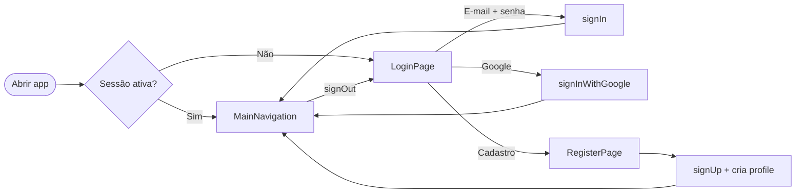
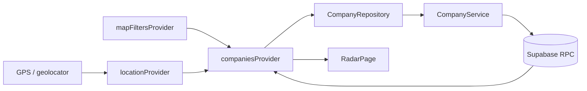
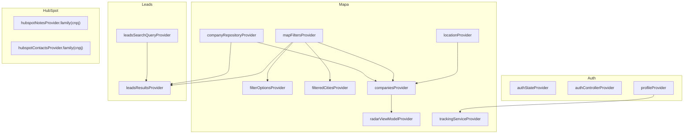

# RUMO App

Aplicativo de prospecção geográfica de leads B2B. Permite que equipes de pré-vendas visualizem empresas próximas no mapa, consultem dados cadastrais e de crédito, registrem novos leads e sincronizem com o HubSpot CRM.

---

## Índice

1. [Requisitos Funcionais](#1-requisitos-funcionais)
2. [User Stories](#2-user-stories)
3. [Estrutura de Navegação](#3-estrutura-de-navegação)
4. [Diagrama de Arquitetura](#4-diagrama-de-arquitetura)
5. [Instalação e Deploy](#5-instalação-e-deploy)

---

## 1. Requisitos Funcionais

### Autenticação e Perfil

| ID | Requisito |
|---|---|
| RF01 | O sistema deve permitir login com e-mail e senha via Supabase Auth |
| RF02 | O sistema deve permitir login com conta Google (OAuth 2.0 + PKCE) |
| RF03 | O sistema deve permitir cadastro de novo usuário com nome, e-mail, senha e departamento |
| RF04 | O sistema deve carregar o perfil do usuário (departamento, nível de acesso) após autenticação |
| RF05 | O sistema deve restringir o cadastro de empresas a usuários dos departamentos Pré-vendas, Gestão e Administração Interna, ou com nível `admin` |

### Mapa / Radar

| ID | Requisito |
|---|---|
| RF06 | O sistema deve exibir o mapa centralizado na localização atual do usuário |
| RF07 | O sistema deve exibir marcadores no mapa para cada empresa encontrada dentro do raio definido |
| RF08 | O sistema deve diferenciar visualmente clientes e leads (ícones distintos por produto) |
| RF09 | O sistema deve exibir uma lista de empresas na parte inferior do mapa |
| RF10 | O sistema deve permitir alternar entre visualização normal e satélite no mapa |

### Filtros

| ID | Requisito |
|---|---|
| RF11 | O sistema deve permitir filtrar empresas por raio geográfico (1 a 50 km) |
| RF12 | O sistema deve permitir filtrar por segmento, produto, UF, cidade e CNAE |
| RF13 | O sistema deve permitir filtrar por tipo de empresa (Todos / Cliente / Lead) |
| RF14 | Os filtros devem ser aplicados de forma reativa — o mapa e a lista atualizam sem recarregamento de página |
| RF15 | O sistema deve permitir limpar todos os filtros de uma vez |

### Detalhes de Empresa

| ID | Requisito |
|---|---|
| RF16 | O sistema deve exibir os dados cadastrais da empresa (CNPJ, endereço, telefone, e-mail, porte, faturamento) |
| RF17 | O sistema deve exibir indicadores de saúde tributária, dívida ativa e score de propensão |
| RF18 | O sistema deve permitir traçar rota até a empresa via Google Maps externo |
| RF19 | O sistema deve exibir notas registradas no HubSpot CRM para a empresa |
| RF20 | O sistema deve exibir contatos vinculados à empresa no HubSpot CRM |
| RF21 | O sistema deve permitir contato via WhatsApp, telefone e e-mail diretamente da tela de detalhes |

### Busca de Leads

| ID | Requisito |
|---|---|
| RF22 | O sistema deve permitir busca textual de empresas por nome ou CNPJ |
| RF23 | A busca deve detectar automaticamente quando a entrada é um CNPJ (formato numérico) |
| RF24 | A busca deve aplicar debounce de 350 ms para evitar requisições excessivas |
| RF25 | Os filtros do mapa devem ser compartilhados com a tela de busca de leads |

### Cadastro de Empresa

| ID | Requisito |
|---|---|
| RF26 | O sistema deve permitir cadastrar uma nova empresa informando o CNPJ |
| RF27 | O sistema deve preencher automaticamente os dados da empresa via API EmpresaAqui |
| RF28 | O sistema deve geocodificar o endereço da empresa para obter latitude e longitude |
| RF29 | O sistema deve verificar se o CNPJ já está cadastrado antes de salvar |
| RF30 | O sistema deve enviar os dados do novo lead para o webhook do CRM após o cadastro |

### Rastreamento de Equipe

| ID | Requisito |
|---|---|
| RF31 | O sistema deve registrar automaticamente a localização do usuário a cada 5 minutos |
| RF32 | O sistema deve manter o registro da posição atual de cada membro da equipe (upsert) |
| RF33 | O sistema deve armazenar o histórico completo de localizações |

---

## 2. User Stories

### Personas

| Persona | Papel | Acesso |
|---|---|---|
| **BDR** | Pré-vendas em campo | Visualiza mapa, cadastra empresas, vê leads |
| **Gestor** | Acompanha time e pipeline | Todos os acessos de BDR + visão da equipe |
| **Executivo** | Visão macro | Apenas visualização (sem cadastro) |

### Stories por Funcionalidade

#### Autenticação
> **US01** — Como usuário, quero fazer login com meu e-mail e senha para acessar o app com segurança.

> **US02** — Como usuário, quero fazer login com minha conta Google para não precisar criar uma senha separada.

> **US03** — Como novo usuário, quero me cadastrar informando meu departamento para que o sistema saiba quais permissões me conceder.

#### Radar / Mapa
> **US04** — Como BDR, quero ver no mapa todas as empresas próximas à minha localização atual para planejar minhas visitas do dia.

> **US05** — Como BDR, quero distinguir visualmente quais empresas já são clientes e quais são leads para focar na prospecção certa.

> **US06** — Como BDR, quero ajustar o raio de busca para controlar quantas empresas aparecem no mapa.

> **US07** — Como BDR, quero filtrar por segmento e cidade para ver apenas empresas do perfil que estou prospectando.

#### Detalhes e Contato
> **US08** — Como BDR, quero tocar no marcador de uma empresa e ver seus dados completos (CNPJ, telefone, saúde tributária) para me preparar antes de uma visita.

> **US09** — Como BDR, quero ver as notas do HubSpot de uma empresa para saber o histórico de contato antes de ligar.

> **US10** — Como BDR, quero traçar rota até a empresa com um toque para navegar sem sair do app.

> **US11** — Como BDR, quero tocar no telefone de uma empresa e já iniciar a ligação para economizar tempo.

#### Cadastro de Empresa
> **US12** — Como BDR, quero digitar um CNPJ e ter os dados da empresa preenchidos automaticamente para agilizar o cadastro.

> **US13** — Como BDR, quero registrar uma empresa nova no sistema para que ela entre na base de leads e no CRM.

#### Busca de Leads
> **US14** — Como gestor, quero buscar uma empresa pelo nome ou CNPJ para encontrá-la rapidamente sem precisar navegar pelo mapa.

> **US15** — Como gestor, quero combinar busca textual com filtros de tipo e segmento para segmentar o resultado.

#### Rastreamento
> **US16** — Como gestor, quero saber a localização atual de cada membro do time para coordenar as visitas em campo.

---

## 3. Estrutura de Navegação

### Mapa de telas

```
Boot (main.dart)
└── authStateProvider
    ├── [sem sessão]
    │   └── LoginPage
    │       ├── E-mail + senha → signIn()
    │       ├── Google → signInWithGoogle()
    │       └── "Criar conta" → RegisterPage
    │
    └── [com sessão]
        └── MainNavigation (CupertinoTabScaffold)
            │
            ├── Aba 0 — Radar
            │   ├── RadarPage
            │   │   ├── GoogleMap com marcadores por tipo de empresa
            │   │   ├── Bottom sheet com lista de empresas
            │   │   ├── Botão de filtros avançados
            │   │   └── Botão "+" (somente BDR / Gestor / Admin)
            │   ├── FilterModal (sobreposto)
            │   │   ├── Slider: raio 1–50 km
            │   │   ├── Dropdowns: segmento, produto, tipo
            │   │   ├── Dropdowns: UF, cidade (filtradas por UF)
            │   │   ├── Dropdown: CNAE
            │   │   └── Botão "Limpar Todos"
            │   ├── CompanyDetailsModal (sobreposto)
            │   │   ├── Header: nome, CNPJ, distância, "Traçar Rota"
            │   │   ├── Cards: saúde tributária, dívida ativa, score, tipo
            │   │   ├── Ações: WhatsApp, e-mail, telefone
            │   │   ├── Contatos HubSpot (carregamento assíncrono)
            │   │   ├── Notas HubSpot (carregamento assíncrono)
            │   │   └── Dados de crédito (somente leads)
            │   └── AddCompanyModal (sobreposto, 3 passos)
            │       ├── Passo 1: CNPJ → EmpresaAqui → geocoding
            │       ├── Passo 2: Dados do sócio / proprietário
            │       └── Passo 3: Dados complementares → salva + webhook CRM
            │
            ├── Aba 1 — Leads
            │   ├── LeadsPage
            │   │   ├── Search bar (debounce 350 ms, detecta CNPJ)
            │   │   ├── Segmented control: Todos / Leads / Clientes
            │   │   ├── Botão de filtros (estado compartilhado com Radar)
            │   │   └── Lista de resultados
            │   ├── FilterModal (mesma instância do Radar)
            │   └── CompanyDetailsModal (mesma instância do Radar)
            │
            └── Aba 2 — Perfil
                └── Botão "Sair da conta" → signOut()
```

### Fluxo de autenticação



### Fluxo de dados do Radar



---

## 4. Diagrama de Arquitetura

### Visão geral do sistema

```
┌───────────────────────────────────────────────────────────────────┐
│                         Browser / Device                          │
│                                                                   │
│  ┌─────────────────────────────────────────────────────────────┐  │
│  │                     Flutter Web App                         │  │
│  │                                                             │  │
│  │   feature/auth   feature/map   feature/leads                │  │
│  │        │               │          feature/company           │  │
│  │        └───────────────┴──────────────┘                     │  │
│  │                        │                                    │  │
│  │           Riverpod (Providers · Notifiers)                  │  │
│  │                        │                                    │  │
│  │   Presentation  ──  State  ──  Domain  ──  Data             │  │
│  │   (Pages/Modals)   (Riverpod)  (Models)  (Services/Repos)   │  │
│  └─────────────────────────────────────────────────────────────┘  │
└───────────────────────────────────────────────────────────────────┘
         │                                          │
         ▼                                          ▼
  ┌────────────────────────────┐            ┌─────────────┐
  │          Supabase          │            │ Google APIs │
  │                            │            │             │
  │  Auth · PostgreSQL · RPCs  │            │ Maps SDK    │
  │                            │            │ Geocoding   │
  │  ┌──────────────────────┐  │            │ Sign-In     │
  │  │    Edge Functions    │  │            └─────────────┘
  │  │  (token no servidor) │  │
  │  │                      │  │
  │  │  hubspot    ─────────┼──┼──► HubSpot CRM
  │  │  empresa-aqui ───────┼──┼──► EmpresaAqui API
  │  └──────────────────────┘  │
  └────────────────────────────┘
         │
         ▼
  ┌────────────┐
  │    CRM     │
  │  Webhook   │
  │ (novo lead)│
  └────────────┘
```

### Camadas internas

```
┌──────────────────────────────────────────────────────┐
│  Presentation                                        │
│  Pages, Modals, ViewModels (Notifier)                │
├──────────────────────────────────────────────────────┤
│  State (Riverpod)                                    │
│  FutureProvider · NotifierProvider · StreamProvider  │
├──────────────────────────────────────────────────────┤
│  Domain                                              │
│  Models: Company, UserProfile, MapFilters            │
│  Interface: ICompanyRepository                       │
├──────────────────────────────────────────────────────┤
│  Data                                                │
│  CompanyRepository · CompanyService                  │
│  HubSpotService · RegistrationService                │
│  TrackingService                                     │
├──────────────────────────────────────────────────────┤
│  Infrastructure                                      │
│  Supabase Client · HTTP · GoogleSignIn · Geolocator  │
└──────────────────────────────────────────────────────┘
```

### Diagrama de providers



---

## 5. Instalação e Deploy

### Pré-requisitos

| Ferramenta | Versão mínima |
|---|---|
| Flutter SDK | 3.5.4+ |
| Dart SDK | 3.5.4+ |
| Docker | 24+ (apenas para deploy) |
| Conta Supabase | projeto criado com tabelas, RPCs e Edge Functions configuradas |
| Google Cloud | Maps JS API, Geocoding API e OAuth habilitados |

---

### Passo 1 — Clonar o repositório

```bash
git clone <url-do-repositorio>
cd rumo-app
```

### Passo 2 — Configurar variáveis de ambiente

Crie `.env` na raiz do projeto (nunca commitar este arquivo):

```env
SUPABASE_URL=https://<seu-projeto>.supabase.co
SUPABASE_ANON_KEY=<sua-chave-anon>
SERVER_WEB_CLIENT_ID=<client-id-web.apps.googleusercontent.com>
CLIENT_ID=<client-id-ios.apps.googleusercontent.com>
GOOGLE_API_KEY=<sua-chave-google>
URL_WEBHOOK_CRM=https://<seu-n8n>/webhook/<rota>
```

| Variável | Origem |
|---|---|
| `SUPABASE_URL` | Supabase → Settings → API |
| `SUPABASE_ANON_KEY` | Supabase → Settings → API → chave **anon** (não service_role) |
| `SERVER_WEB_CLIENT_ID` | Google Cloud Console → OAuth 2.0 → Web |
| `CLIENT_ID` | Google Cloud Console → OAuth 2.0 → iOS (deixar em branco se só web) |
| `GOOGLE_API_KEY` | Google Cloud Console → Credentials |
| `URL_WEBHOOK_CRM` | URL do workflow n8n que recebe novos leads |

> **Credenciais sensíveis:** `HUBSPOT_TOKEN` e `TOKEN_EMPRESA_AQUI` **não ficam no `.env`**. Elas são armazenadas como secrets das Edge Functions no Supabase (ver Passo 3).

### Passo 3 — Configurar secrets das Edge Functions

As chamadas ao HubSpot CRM e à API EmpresaAqui são feitas por Edge Functions no Supabase, nunca pelo cliente. Os tokens ficam armazenados com segurança no servidor.

Acesse **Supabase Dashboard → Edge Functions → Secrets** e adicione:

| Secret | Valor |
|---|---|
| `HUBSPOT_TOKEN` | Token de acesso privado do HubSpot |
| `TOKEN_EMPRESA_AQUI` | Token da API EmpresaAqui |

Ou via CLI do Supabase:

```bash
supabase secrets set \
  HUBSPOT_TOKEN=<seu-token> \
  TOKEN_EMPRESA_AQUI=<seu-token> \
  --project-ref <ref-do-projeto>
```

### Passo 4 — Instalar dependências

```bash
flutter pub get
```

---

### Desenvolvimento local

```bash
# Rodar no Chrome
flutter run -d chrome --dart-define-from-file=.env

# Rodar em dispositivo físico ou simulador
flutter run --dart-define-from-file=.env

# Análise estática
flutter analyze
```

---

### Build web para produção

```bash
flutter build web --release --dart-define-from-file=.env
# Saída em: build/web/
```

Validar o build localmente antes de subir:

```bash
cd build/web && python3 -m http.server 8080
# Acesse http://localhost:8080
```

---

### Deploy com Docker

O projeto usa um `Dockerfile` multi-stage e um `docker-compose.yml` prontos para produção.

**Como funciona o build:**

1. **Stage 1** (`ubuntu:22.04`): instala o Flutter e compila o app com `--dart-define-from-file=.env`. As variáveis do `.env` são embutidas no bundle JS neste momento.
2. **Stage 2** (`nginx:alpine`): copia apenas `build/web/` e serve os estáticos na porta 80. O `.env` **não** está presente neste estágio.

#### Subir localmente

```bash
docker compose up --build
# Acesse http://localhost
```

Para rebuild forçado após mudanças no código:

```bash
docker compose up --build --force-recreate
```

Para rodar em background:

```bash
docker compose up -d --build
docker compose logs -f   # acompanhar logs
docker compose down      # encerrar
```

#### Deploy em servidor de produção

**1. Copiar os arquivos necessários para o servidor:**

```bash
scp .env Dockerfile docker-compose.yml nginx.conf usuario@servidor:/app/rumo/
```

> O `.env` precisa estar no servidor apenas durante o `docker build`. Após o build, ele não é copiado para a imagem final.

**2. Conectar no servidor e subir o container:**

```bash
ssh usuario@servidor
cd /app/rumo
docker compose up -d --build
```

**3. Verificar que está rodando:**

```bash
docker compose ps
docker compose logs rumo-app
```

**4. Atualizar para uma nova versão:**

```bash
# Puxa o novo código (se usar git no servidor)
git pull

# Reconstruir e reiniciar sem downtime percebido
docker compose up -d --build
```

#### HTTPS em produção

O container expõe apenas HTTP na porta 80. Em produção, coloque um proxy reverso na frente:

**Com Caddy** (recomendado — provisiona TLS automaticamente):

```caddyfile
# /etc/caddy/Caddyfile
app.seudominio.com.br {
    reverse_proxy localhost:80
}
```

**Com nginx externo:**

```nginx
server {
    listen 443 ssl;
    server_name app.seudominio.com.br;
    ssl_certificate     /etc/letsencrypt/live/app.seudominio.com.br/fullchain.pem;
    ssl_certificate_key /etc/letsencrypt/live/app.seudominio.com.br/privkey.pem;

    location / {
        proxy_pass http://localhost:80;
        proxy_set_header Host $host;
    }
}
```

#### Estrutura da imagem

```
Dockerfile (multi-stage)
├── Stage 1 — builder (ubuntu:22.04)
│   ├── Flutter 3.41.3
│   ├── flutter pub get
│   └── flutter build web --release --dart-define-from-file=.env
│       └── output: /app/build/web/
│
└── Stage 2 — runtime (nginx:alpine)
    ├── COPY build/web/ → /usr/share/nginx/html
    ├── COPY nginx.conf → /etc/nginx/conf.d/default.conf
    └── EXPOSE 80
```

---

### Banco de dados (Supabase)

As tabelas e RPCs abaixo devem estar criadas no projeto Supabase antes de rodar o app.

#### Tabelas necessárias

| Tabela | Colunas principais |
|---|---|
| `profiles` | `id`, `email`, `nome`, `departamento`, `nivel_acesso` |
| `central_data` | `cnpj`, `latitude`, `longitude`, `is_client`, dados EmpresaAqui |
| `tracking_equipe` | `user_id`, `email`, `nome`, `latitude`, `longitude`, `ultimo_visto` |
| `tracking_history` | `user_id`, `latitude`, `longitude`, `captured_at` |

#### RPCs necessárias

| Função | Descrição |
|---|---|
| `search_companies_in_radius(p_lat, p_lon, p_radius_km, ...)` | Busca geográfica com filtros |
| `search_companies_text(p_query, p_is_cnpj, ...)` | Busca textual por nome ou CNPJ |
| `get_filter_options()` | Retorna opções para dropdowns de filtro |

---

## Referências técnicas

- Arquitetura de código, diagrama de providers e padrões Riverpod: [`CLAUDE.md`](./CLAUDE.md)
- Configuração de variáveis de ambiente: [`lib/core/app_config.dart`](./lib/core/app_config.dart)
- Entrypoint da aplicação: [`lib/main.dart`](./lib/main.dart)
